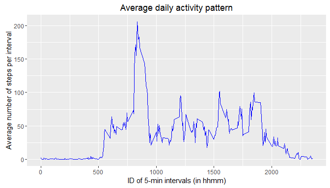

# Reproducible Research: Peer Assessment 1
Frank La  
March 24, 2016  

 

# Loading and preprocessing the data

We assume that current directory is where the repository is cloned, with the zip file in place.

Check if data is there. If not, unzip and load the data.


```r
if(!exists("activity")){
  unzip("activity.zip")
  activity <- read.csv("activity.csv", header = TRUE, na.strings = "NA")
}
```


Explore the data:


```r
str(activity)
```

```
## 'data.frame':	17568 obs. of  3 variables:
##  $ steps   : int  NA NA NA NA NA NA NA NA NA NA ...
##  $ date    : Factor w/ 61 levels "2012-10-01","2012-10-02",..: 1 1 1 1 1 1 1 1 1 1 ...
##  $ interval: int  0 5 10 15 20 25 30 35 40 45 ...
```

```r
head(activity)
```

```
##   steps       date interval
## 1    NA 2012-10-01        0
## 2    NA 2012-10-01        5
## 3    NA 2012-10-01       10
## 4    NA 2012-10-01       15
## 5    NA 2012-10-01       20
## 6    NA 2012-10-01       25
```

Load necessary libraries.


```r
library(dplyr)
library(ggplot2)
library(lubridate)
```


# What is mean total number of steps taken per day?

Calculate the total number of steps taken per day. For this part of the assignment, I can ignore the missing values in the dataset as instructed.


```r
act1 <- activity %>%
        filter(!is.na(steps)) %>%
        group_by(date) %>%
        summarise(total = sum(steps))
```

Make a histogram of the total number of steps taken each day:


```r
g1 <- ggplot(act1, aes(total))
g1 + geom_histogram(binwidth = 500, colour="black", fill="white") +
  labs(x = "Total number of steps per day")
```

<!-- -->

The mean and median of the total number of steps taken per day are therefore


```r
mean(act1$total)
```

```
## [1] 10766.19
```

```r
median(act1$total)
```

```
## [1] 10765
```


# What is the average daily activity pattern?

Average the number of steps taken (per interval) across all days:


```r
act2 <- activity %>%
  filter(!is.na(steps)) %>%
  group_by(interval) %>%
  summarise(average = mean(steps))
```

Make a time series plot:


```r
g2 <- ggplot(act2, aes(interval, average))
g2 + geom_line(color='blue') + 
  labs(x = "ID of 5-min intervals (in hhmm)", y = "Average number of steps per interval", 
       title = "Average daily activity pattern")
```

<!-- -->


Therefore the 5-minute interval on average across all the days in the dataset that contains the maximum number of steps is


```r
act2$interval[which.max(act2$average)]
```

```
## [1] 835
```

i.e., at *08:35 am*.

# Imputing missing values

The total number of missing values in the dataset is


```r
sum(is.na(activity$steps))
```

```
## [1] 2304
```

As a strategy for filling in all of the missing values in the dataset, here I could use **the mean steps for the corresponding 5-minute interval**. Note that as the number of steps should be an integer, **I will round the values to the nearest number**.

Create a new dataset that is equal to the original dataset but with the missing data filled in:


```r
new.act <- activity

for(i in seq_along(new.act$steps)) {
  if(is.na(new.act$steps[i])) {
    if(i %% nrow(act2) > 0){
        new.act$steps[i] <- round(act2$average[i %% nrow(act2)])
    }
    else {
        new.act$steps[i] <- round(act2$average[nrow(act2)])
    }
  }
}
```

Calculate and report the mean and median total number of steps taken per day: 


```r
new.act1 <- new.act %>%
            group_by(date) %>%
            summarise(total = sum(steps))

mean(new.act1$total)
```

```
## [1] 10765.64
```

```r
median(new.act1$total)
```

```
## [1] 10762
```


Next, make a histogram of the total number of steps taken each day:


```r
g3 <- ggplot(new.act1, aes(total))
g3 + geom_histogram(binwidth = 500, colour="black", fill="white") +
  labs(x = "Total number of steps per day")
```

<!-- -->

**What is the impact of imputing missing data on the estimates of the total daily number of steps?**

- More observations are seen near the mean compared to the previous histogram due to the mean imputation strategy.
- The imputation reduces the variance of the data and hence we see a seemingly steeper distribution. 


# Are there differences in activity patterns between weekdays and weekends?

Create a new factor variable in the dataset with two levels -- "weekday" and "weekend" indicating whether a given date is a weekday or weekend day:


```r
dayofweek <- wday(ymd(new.act$date))
dayofweek <- sapply(dayofweek, function(x){
  if(x %in% c(1,7)) { ## 1 = "Sun", 7 = "Sat"
    "weekend"
  }
  else {
    "weekday"
  }
})
new.act <- cbind(new.act, dayofweek = as.factor(dayofweek))
```

Make a panel plot containing a time series plot of the 5-minute interval (x-axis) and the average number of steps taken, averaged across all weekday days or weekend days (y-axis):


```r
new.act2 <- new.act %>%
          group_by(dayofweek, interval) %>%
          summarise(average = mean(steps))

g4 <- ggplot(new.act2, aes(interval, average))

g4 + geom_line(color='blue') + facet_grid(dayofweek ~ .) + 
  labs(x = "ID of 5-min intervals (in hhmm)", y = "Average number of steps per interval", 
       title = "Average daily activity pattern (after imputation)")
```

<!-- -->
